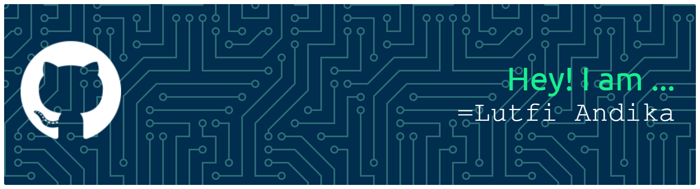

## 

# Hi, I'm Lutfi Andika, a Web Developer currently diving into React! ⚛️ 👋

## About Me 🧑‍💻

I'm a **Web Developer** passionate about the full front-end stack (**HTML, CSS, JavaScript**) and specializing in building impactful **educational/school websites** 🏫. My goal is to combine technology and education to create interactive learning experiences 📚.

I love coding 💻, exploring new technologies, and I'm currently focused on mastering the **React.js** framework to create dynamic, modern user interfaces.

---

## 🚀 Current Focus

🔥 Deep diving into **React.js** for modern component-based UI development.
✨ Exploring state management and hooks in React.

---

## Skills 🛠️

### 💻 Core Languages & Backend

### ⚛️ Frameworks & Libraries

### 🎨 UI Components & Tools

---

## Projects 📂

* **[My Portfolio](https://portofoliomla.netlify.app/)**
    > **Status:** Live. A personal showcase of my development skills and projects, built with a modern component-based approach.
     

* **[School Website Template](https://github.com/username/school-website)**
    > **Status:** Ongoing/Completed. A complete, responsive template for educational institutions, utilizing Bootstrap for rapid UI development and PHP for backend functionality.
     

---

## Connect with Me 🤝

  

> Feel free to reach out if you'd like to collaborate on a project, especially one related to technology and education! 💬

---

## GitHub Stats

